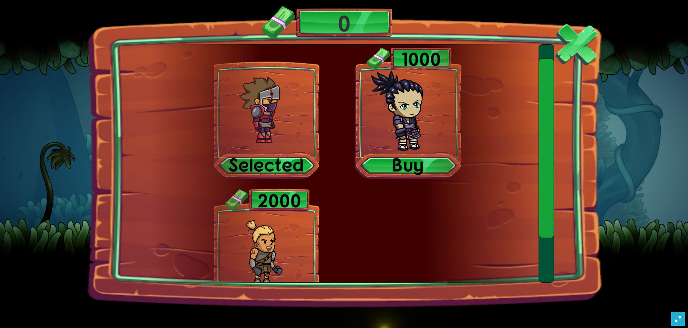
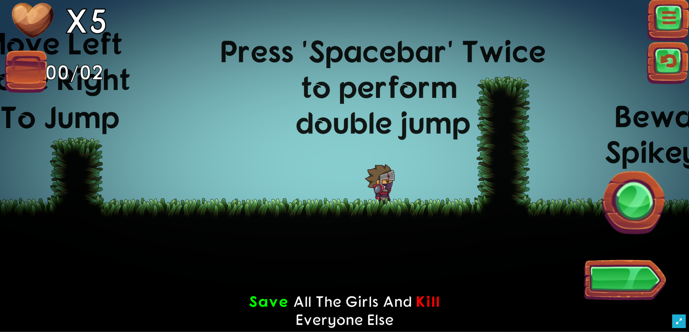

# SAGE

SAGE "Save the Lost Girl" is a web adventure game with a mission to save a girl who is missing/captured by enemy forces named "SAGE", this game is dedicated to the HD Games Hackathon which combines Unity, Web3, Mantle and other technologies.

## WHY?

1. Have an on-chain game audit trail of each user that is stored in a database collection and stored in IPFS.

2. Safely share selected data from digital documents because SAGE does not store personal data like other game platforms.

3. Our platform opens up web3 workflows with smart contract hooks and AI

4. Using a decentralized mantle chain and public blockchain as well as technologies that can revolutionize performance in gaming platforms using web3.

## There are 2 main repos:

1. Contract Data: Uses Solidity to complete the entire Game Protocol.

2. Data Game Project: Using Web3, Unity and Mantle Chain for on-chain development in game development.

## Game Demo : https://app-sage.pages.dev
## Gameplay Video Demo: https://youtu.be/wy2l6A4_lbk

## Features.
1. Bridge
2. More Characters
3. More Levels to Complete
4. More incentives

## Tech.
1. Mantle
2. Metamask
3. Hardhat
4. Web3Unity
5. Unity

## Wallets Connector:
1. Metamask
2. WalletConnect
3. Torus

### Buy Hero

### Game Level

### Gameplay

### Edit Profile

### Swap/Buy Token

### Wallet Connector

## Base

1. Websites: https://app-sage.pages.dev
2. Github Repos: https://github.com/Agin-DropDisco/HD-Games-Dorahacks
